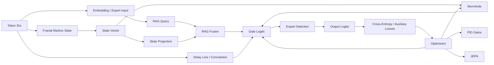
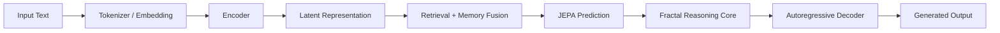

# Architecture

## Data flow summary

1. Tokens enter the model.
2. Fractal Markov state expands into a structured state vector.
3. The input embedding queries the in-memory retrieval store.
4. Retrieved state, wormhole, and delayed signal features contribute to gating.
5. The gate selects experts and produces output logits.
6. Losses update the expert projections, gate, PID gains, and JEPA path.
7. Checkpointing and SQLite storage preserve the full runtime state.

## Notes

- The retrieval store is in-memory and brute-force.
- The system is pure Python and optimized for clarity over throughput.
- The naming is descriptive branding for custom mechanisms, not a claim of standard methods.

## Encoder-Decoder Hybrid (Fusion Model)

### Data flow summary

1. Input text is tokenized and embedded.
2. The encoder produces a contextual latent representation.
3. Retrieval and memory fusion enrich the latent state.
4. JEPA prediction and the reasoning core transform the latent state.
5. The autoregressive decoder generates the final output sequence.

### Notes

- RoBERTa-style encoders are used strictly as encoders after removing the final classification layer.
- GPT-style decoders are used strictly as autoregressive decoders.
- The document describes a modular fusion pattern, not a claim that specific external model weights are bundled with the package.

## Implementation Notes

The fusion model is implemented as a pluggable encoder-decoder interface. The repository ships with a pure-Python native encoder and autoregressive decoder, plus adapter classes for external RoBERTa- and GPT-style models.
