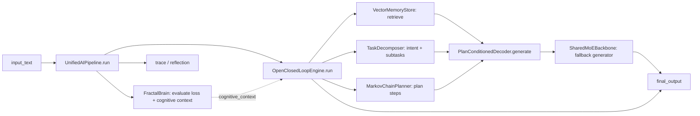

# The Unified Pipeline

This describes the v3 "unification" layer -- `ai_pipeline.py` / `hybrid_engine.py`
/ `hybrid_cli.py` -- that wraps `fractal_brain/` and the closed-loop engine
(`engine.py` and its neighbors) into one system. It's the newest part of this
repository and, until now, the only part with no dedicated documentation; see
`ARCHITECTURE.md`, `API_REFERENCE.md`, and `TRAINING_GUIDE.md` for `fractal_brain`
itself, and `docs/open_closed_loop_README.md` for the engine's pre-merge history.

## Component map



- **`UnifiedAIPipeline`** (`ai_pipeline.py`) is the outer orchestrator. Each
  `run(input_text)` call: normalizes the text, tokenizes it for `FractalBrain`,
  calls `FractalBrain.evaluate()` (read-only -- this does **not** train the
  brain) to get a loss/top-tokens "cognitive context", then calls
  `OpenClosedLoopEngine.run()` with that context, and finally assembles a
  `UnifiedPipelineResult` with the answer, a reflection, and a stage-by-stage
  trace. `HybridCognitiveEngine` (in the same file) is a thin session wrapper
  that keeps `UnifiedAIPipeline` instances alive across turns.
- **`OpenClosedLoopEngine`** (`engine.py`) is the older "closed-loop" engine:
  retrieval (`memory.py`) -> decomposition (`decomposer.py`) -> planning
  (`planner.py`) -> generation (`decoder.py` + `moe_model.py`). This is what
  actually produces `final_output`.
- **`FractalBrain`**'s role here is a **cognitive scorer**, not the generator.
  Its loss and top-token guesses ride along as extra context for the prompt
  the closed-loop engine builds, but the answer text itself comes from the
  closed-loop engine's decoder.
- **`ocle_clean_build/`** re-exports the closed-loop modules under a package
  namespace (`ocle_clean_build.engine.OpenClosedLoopEngine` etc.) for anyone
  who wants to `import` this as a package rather than loose top-level modules.

## The fallback generator, and when it uses retrieval directly

`SharedMoEBackbone` (`moe_model.py`) is a rule-based fallback generator, not a
real language model -- there is no code path in this pure-Python build that
loads `model_name`/`fallback_model_name` (see "Known limitations" below).
Since the reviewed-and-fixed version of this pipeline, it uses the *actual*
retrieved documents and plan instead of a fixed template:

- If the best-scoring retrieved document's cosine similarity is at or above
  `model.retrieval_confidence_threshold` in `config.yaml` (default `0.5`), the
  answer leads with that document's text (and its `step_texts`, if the
  bootstrap record had any) as the proposed answer.
- Otherwise, it falls back to listing the *actual* plan actions (or
  subtasks, if the planner produced none) it computed for this request --
  not a hardcoded, request-independent list.

Tune `retrieval_confidence_threshold` if you add a larger/noisier memory
corpus: lower it to surface more (less certain) matches, raise it to only
trust near-exact matches.

## CLI usage (`hybrid_cli.py`)

```bash
python hybrid_cli.py --mode pipeline --text "Solve the integral of 2x from 0 to 4." --config config.yaml
python hybrid_cli.py --mode session  --text "First turn || Second turn"   # "||"-separated turns, one session
python hybrid_cli.py --mode closed-loop --text "..."                      # OpenClosedLoopEngine only, no FractalBrain
python hybrid_cli.py --mode fractal                                       # FractalBrain standalone demo, not wired to the engine
```

All modes print a JSON payload to stdout. `pipeline`/`session` payloads
include `final_output`, `closed_loop` (retrieval/intent/subtasks/plan),
`fractal` (cognitive context), `reflection`, and `trace` (one entry per
pipeline stage, each with a short `data` dict -- useful for debugging why a
particular answer came out the way it did).

## Config reference (`config.yaml`)

Fields specific to this layer (see the file itself for the rest):

| Field | Effect |
| --- | --- |
| `retrieval.top_k` | How many documents `VectorMemoryStore.retrieve()` returns. |
| `retrieval.max_documents` | Soft cap on the in-memory document list (not the SQLite table). |
| `decomposition.max_subtasks` | Max subtasks `TaskDecomposer` returns. |
| `planner.n_states` / `max_plan_steps` | Size of the learned state space / plan length cap. |
| `model.retrieval_confidence_threshold` | See above. |
| `model.model_name`, `quantization.*` | Accepted for forward-compatibility with a possible future real-model backend. Nothing reads these today; setting them to anything other than `fallback`/`none`/`auto` now logs a `UserWarning` saying so, rather than silently doing nothing. |

## Known limitations

Being direct about these so they don't have to be rediscovered later:

- **The generator is rule-based, not a model.** It can surface a retrieved
  answer verbatim or list plan steps; it cannot reason beyond that.
- **Retrieval and embeddings are hash-based**, not semantic (`tokenizer.py`'s
  `TextEmbedder` is a normalized bag-of-hashed-words vector). Matching is
  essentially keyword overlap -- good for near-exact repeats of bootstrap
  content, unreliable for paraphrases.
- **The decomposer is a small keyword classifier** (`math_symbolic` /
  `coding` / `engineering` / `general`). Anything more nuanced than that will
  get a generic bucket.
- **The planner's action space is only as rich as the bootstrap dataset.**
  With four bootstrap records, it has learned four short state->action
  chains; novel requests get mapped to the nearest of those, which may not
  be a great fit.
- **`data/bootstrap_dataset.jsonl` is the entire memory corpus** out of the
  box. `VectorMemoryStore.bootstrap()` is idempotent (safe to run on every
  `initialize()`), but it's still a tiny, hand-written dataset -- retrieval
  quality is bounded by what's in it.

None of these are hidden failures -- they're the honest current shape of a
pure-Python, zero-dependency system, matching the project's existing
"know what you actually have" documentation style in `ARCHITECTURE.md` and
`To-Do.md`.
