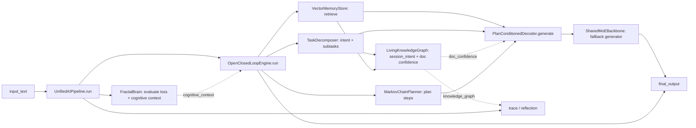

# The Unified Pipeline

This describes the v3 "unification" layer -- `ai_pipeline.py` / `hybrid_engine.py`
/ `hybrid_cli.py` -- that wraps `fractal_brain/` and the closed-loop engine
(`engine.py` and its neighbors) into one system. It's the newest part of this
repository and, until now, the only part with no dedicated documentation; see
`ARCHITECTURE.md`, `API_REFERENCE.md`, and `TRAINING_GUIDE.md` for `fractal_brain`
itself, and `docs/open_closed_loop_README.md` for the engine's pre-merge history.

## Component map



- **`UnifiedAIPipeline`** (`ai_pipeline.py`) is the outer orchestrator. Each
  `run(input_text)` call: normalizes the text, tokenizes it for `FractalBrain`,
  calls `FractalBrain.evaluate()` (read-only -- this does **not** train the
  brain) to get a loss/top-tokens "cognitive context", then calls
  `OpenClosedLoopEngine.run()` with that context, and finally assembles a
  `UnifiedPipelineResult` with the answer, a reflection, and a stage-by-stage
  trace. `HybridCognitiveEngine` (in the same file) is a thin session wrapper
  that keeps `UnifiedAIPipeline` instances alive across turns.
- **`OpenClosedLoopEngine`** (`engine.py`) is the older "closed-loop" engine:
  retrieval (`memory.py`) -> decomposition (`decomposer.py`) -> planning
  (`planner.py`) -> generation (`decoder.py` + `moe_model.py`). This is what
  actually produces `final_output`.
- **`LivingKnowledgeGraph`** (`lkg.py`) is a structured, cross-turn memory the
  engine updates every turn; generation reads a narrow trust signal from it
  (see "Structured knowledge tracking" below) but it isn't itself a
  generator.
- **`FractalBrain`**'s role here is a **cognitive scorer**, not the generator.
  Its loss and top-token guesses ride along as extra context for the prompt
  the closed-loop engine builds, but the answer text itself comes from the
  closed-loop engine's decoder.
- **`ocle_clean_build/`** re-exports the closed-loop modules under a package
  namespace (`ocle_clean_build.engine.OpenClosedLoopEngine` etc.) for anyone
  who wants to `import` this as a package rather than loose top-level modules.

## Structured knowledge tracking (`lkg.py`)

`OpenClosedLoopEngine` owns one `LivingKnowledgeGraph` (Beta-Bernoulli fact
confidence + per-source reliability + particle-filtered entity-state
tracking, all originally standalone -- see its own module docstring for the
model itself). Every `run()`:

- Records the turn's task intent (`math_symbolic`/`coding`/`engineering`/
  `general`, `decomposer.KNOWN_INTENTS`) as an observed state of a
  `session_intent` entity, so the graph learns a session's actual
  intent-transition pattern and can predict what it's likely to ask about
  next (`predict_entity_state`).
- Looks up (does not yet set) each retrieved document's current
  `matched_intent` confidence for this intent, to hand to the decoder below.

Confidence in a document's `matched_intent` fact is **purely
feedback-driven**: retrieval alone never touches it (a never-fed-back-on
document reads as a neutral 0.5, not an inflated score). Only `close_loop()`
calls `add_fact`, reinforcing or penalizing every document retrieved for
that interaction once real feedback is known, attributed to the document's
origin (`bootstrap`, `pipeline_feedback`, or `successful_interaction` --
`engine._document_source`). An earlier version of this integration had
retrieval itself vote positive evidence weighted by cosine score, which
turned out to put a floor of `score/(score+1)` under confidence -- worst for
the highest-scoring documents, since a near-1.0 score pushes that floor
toward 0.5, making the low-confidence signal hardest to trigger for exactly
the documents `retrieval_confidence_threshold` trusts enough to surface
verbatim. See `CHANGELOG.md` ("matched_intent confidence made purely
feedback-driven") for the empirical trace that found this.

The graph's state is surfaced three ways:
- In the result's `knowledge_graph` field (predicted next intent +
  distribution, per-document confidence) and folded into `cognitive_context`.
- In two reflection risk notes: a topic-shift warning when this turn's
  intent departs from the session's tracked pattern, and a low-confidence
  warning when retrieved documents have a poor track record for this intent
  (`knowledge_graph.low_confidence_threshold` in `config.yaml`, shared with
  the point below so both stay in sync).
- In generation itself: `SharedMoEBackbone` appends a caution line when the
  document it's about to surface verbatim clears the retrieval-similarity
  bar but has *low* knowledge-graph confidence -- a real, if narrow, way
  this graph now shapes `final_output`, not just observes it. To keep that
  caution from going stale, `close_loop()` strips it out of a successful
  interaction's text before storing that text as a future retrievable
  "solved example" -- otherwise the caution (and the confidence number
  inside it) would get echoed back verbatim in later turns regardless of
  what confidence had become by then.

See `CHANGELOG.md` for why `from_config` and `observe_entity_transition`
were added to `lkg.py` during this integration (neither existed in the
original standalone module).

## The fallback generator, and when it uses retrieval directly

`SharedMoEBackbone` (`moe_model.py`) is a rule-based fallback generator, not a
real language model -- there is no code path in this pure-Python build that
loads `model_name`/`fallback_model_name` (see "Known limitations" below).
Since the reviewed-and-fixed version of this pipeline, it uses the *actual*
retrieved documents and plan instead of a fixed template:

- If the best-scoring retrieved document's cosine similarity is at or above
  `model.retrieval_confidence_threshold` in `config.yaml` (default `0.5`), the
  answer leads with that document's text (and its `step_texts`, if the
  bootstrap record had any) as the proposed answer.
  - If that document's knowledge-graph `matched_intent` confidence (see
    "Structured knowledge tracking" above) is below
    `knowledge_graph.low_confidence_threshold`, a caution line is appended
    noting its track record, even though its cosine similarity cleared the
    bar above -- a real, if narrow, way the graph now shapes `final_output`.
- Otherwise, it falls back to listing the *actual* plan actions (or
  subtasks, if the planner produced none) it computed for this request --
  not a hardcoded, request-independent list.

Tune `retrieval_confidence_threshold` if you add a larger/noisier memory
corpus: lower it to surface more (less certain) matches, raise it to only
trust near-exact matches.

A quirk worth knowing if you're stress-testing with the same near-identical
query repeatedly: `close_loop()` stores a successful interaction's full
output text as a new, future retrievable "solved example"
(`source: successful_interaction`). If that stored text itself included this
backend's own preamble (`"Fallback backend active..."`), a later turn that
retrieves it can echo that preamble back verbatim, nested inside its own new
preamble -- a pre-existing property of treating past output as a future
example, not something this integration introduced. The one part of this
specific to the work here -- the knowledge-graph caution line above going
stale if stored and echoed the same way -- is handled: `close_loop()` strips
it before storing (see `CHANGELOG.md`). The broader nesting is not, and
remains an open item for whoever next touches this storage path.

## CLI usage (`hybrid_cli.py`)

```bash
python hybrid_cli.py --mode pipeline --text "Solve the integral of 2x from 0 to 4." --config config.yaml
python hybrid_cli.py --mode session  --text "First turn || Second turn"   # "||"-separated turns, one session
python hybrid_cli.py --mode closed-loop --text "..."                      # OpenClosedLoopEngine only, no FractalBrain
python hybrid_cli.py --mode fractal                                       # FractalBrain standalone demo, not wired to the engine
python hybrid_cli.py --mode tune --trials 20                              # search config.yaml's own values -- see docs/ADAPTIVE_OPTIMIZER.md
```

All modes print a JSON payload to stdout. `pipeline`/`session` payloads
include `final_output`, `closed_loop` (retrieval/intent/subtasks/plan/
knowledge_graph), `fractal` (cognitive context), `reflection`, and `trace`
(one entry per pipeline stage, each with a short `data` dict -- useful for
debugging why a particular answer came out the way it did).

## Config reference (`config.yaml`)

Fields specific to this layer (see the file itself for the rest):

| Field | Effect |
| --- | --- |
| `retrieval.top_k` | How many documents `VectorMemoryStore.retrieve()` returns. |
| `retrieval.max_documents` | Soft cap on the in-memory document list (not the SQLite table). |
| `decomposition.max_subtasks` | Max subtasks `TaskDecomposer` returns. |
| `planner.n_states` / `max_plan_steps` | Size of the learned state space / plan length cap. |
| `model.retrieval_confidence_threshold` | See above. |
| `knowledge_graph.num_particles` | Particle-filter width for `LivingKnowledgeGraph`. More particles trade runtime for a smoother posterior. |
| `knowledge_graph.forgetting_factor` | Per-step decay applied to fact confidence and source reliability alike. |
| `knowledge_graph.seed` | RNG seed for the particle filter, for reproducible runs. |
| `knowledge_graph.low_confidence_threshold` | Shared by the reflection risk note and the generation caveat (see "Structured knowledge tracking" above): below this mean `matched_intent` confidence, a document is treated as historically unreliable for its intent. |
| `model.model_name`, `quantization.*` | Accepted for forward-compatibility with a possible future real-model backend. Nothing reads these today; setting them to anything other than `fallback`/`none`/`auto` now logs a `UserWarning` saying so, rather than silently doing nothing. |

## Known limitations

Being direct about these so they don't have to be rediscovered later:

- **The generator is rule-based, not a model.** It can surface a retrieved
  answer verbatim or list plan steps; it cannot reason beyond that.
- **Retrieval and embeddings are hash-based**, not semantic (`tokenizer.py`'s
  `TextEmbedder` is a normalized bag-of-hashed-words vector). Matching is
  essentially keyword overlap -- good for near-exact repeats of bootstrap
  content, unreliable for paraphrases.
- **The decomposer is a small keyword classifier** (`math_symbolic` /
  `coding` / `engineering` / `general`). Anything more nuanced than that will
  get a generic bucket.
- **The planner's action space is only as rich as the bootstrap dataset.**
  With four bootstrap records, it has learned four short state->action
  chains; novel requests get mapped to the nearest of those, which may not
  be a great fit.
- **`data/bootstrap_dataset.jsonl` is the entire memory corpus** out of the
  box. `VectorMemoryStore.bootstrap()` is idempotent (safe to run on every
  `initialize()`), but it's still a tiny, hand-written dataset -- retrieval
  quality is bounded by what's in it.
- **The knowledge graph is in-memory only**, like the rest of `EngineState`
  -- it doesn't persist across process restarts (`fractal_brain/checkpoint.py`
  has a save/load system, but nothing analogous exists yet on the
  closed-loop/OCLE side for engine-level state). Its `session_intent`
  tracking is also only as useful as it has turns to learn from: with four
  intent categories and typically short sessions, predictions stay close to
  uniform until a session has run a handful of turns.

None of these are hidden failures -- they're the honest current shape of a
pure-Python, zero-dependency system, matching the project's existing
"know what you actually have" documentation style in `ARCHITECTURE.md` and
`To-Do.md`.
